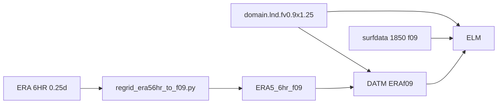

# I1850ERACNPRDCTCBC + ERA→f09 — 1980 pilot and smoke test

**Date:** 2026-08-09  
**Status:** Full-year 1980 forcing on disk; 5-day Frontier smoke test **PASSED** (job `5216389`).

## Recommendation: where this report lives

Primary home: **`kmELM/docs/`** (this file).

| Location | Role |
|---|---|
| **`kmELM/docs/`** | Experiment / case reports, smoke results, ELM/DATM wiring notes |
| **`kmELM/scripts/frontier/`** | Case creation scripts |
| **`kiloCraft/`** | Forcing tree + regrid script (data product), not case narrative |
| **`kmELM/E3SM/`** | Source tree — avoid parking project notes inside upstream E3SM |

A short pointer under `kiloCraft/scripts/` can be added later if useful; the authoritative status report stays here.

---

## Goal

Provide alias **`I1850ERACNPRDCTCBC`**:

```text
1850_DATM%ERAf09_ELM%CNPRDCTCBC_SICE_SOCN_MOSART_SGLC_SWAV
```

Regrid ERA 6-hourly 0.25° forcing onto the exact **f09 (0.9×1.25, nj=192, ni=288)** mesh so DATM and ELM share one grid, reusing stock f09 domain and 1850 surfdata.

## Locked design

| Item | Value |
|---|---|
| Resolution | `f09_f09` |
| Machine / compiler | Frontier / **`craygnu`** (not `gnu`) |
| DATM mode | **`ERAf09`** (not `ERA56HRf09` — substring collision with `ERA56HR`) |
| Pilot year | **1980** |
| Coupling | `ATM/LND/ROF/ICE_NCPL=4` (6-hourly; ROF must match LND) |
| Forcing root | `/lustre/orion/cli115/world-shared/wangd/kiloCraft/ERA5_6hr_f09` |
| `DIN_LOC_ROOT` | `/lustre/orion/cli115/world-shared/e3sm/inputdata` |
| `DIN_LOC_ROOT_CLMFORC` | `/lustre/orion/cli115/world-shared/wangd/kiloCraft` |
| E3SM tree | `/lustre/orion/cli115/world-shared/wangd/kmELM/E3SM` |

### Stock shared mesh files

| Role | Path under `DIN_LOC_ROOT` |
|---|---|
| Land + DATM domain | `share/domains/domain.lnd.fv0.9x1.25_gx1v6.090309.nc` |
| 1850 surfdata | `lnd/clm2/surfdata_map/surfdata_0.9x1.25_simyr1850_c180306.nc` |

Domain is also present under `ERA5_6hr_f09/domain.lnd.fv0.9x1.25_gx1v6.090309.nc`.



---

## Forcing (1980)

- **Script:** `kiloCraft/scripts/regrid_era56hr_to_f09.py`  
- **Python:** `/lustre/orion/cli115/world-shared/wangd/amd_env/bin/python`  
- **Output layout:** `ERA5_6hr_f09/{lwdn,pbot,prec,swdn,tbot,tdew,wind}/`  
- **File pattern:** `elmforc.ERA5.c2018.0.9x1.25.<var>.YYYY-MM.nc`  
- **Shape:** `(time, lat, lon) = (nt, 192, 288)` — ~124 steps/month for 6-hourly  
- **Stream vars:** `msdwlwrf, sp, mcpr, mlspr, msdrswrf, msdfswrf, t2m, d2m, w10`  
- **Inventory:** **108** files = 12 months × 9 vars for 1980  
- **Log:** `ERA5_6hr_f09/regrid_1980_rest.log`

---

## E3SM / CIME wiring

Touched under `kmELM/E3SM`:

1. `components/elm/cime_config/config_compsets.xml` — alias `I1850ERACNPRDCTCBC` → `%ERAf09` + `ELM%CNPRDCTCBC`
2. `components/data_comps/datm/cime_config/config_component.xml` — `%ERAf09`, `DATM_MODE=ERAf09`, year defaults 1980
3. `components/data_comps/datm/cime_config/namelist_definition_datm.xml` — ERAf09 streams → `$DIN_LOC_ROOT_CLMFORC/ERA5_6hr_f09/...`, `datamode=CLMNCEP`, fill/tint/dtlimit maps  
   Backup: `namelist_definition_datm.xml.bak_era56hrf09`

**Case script:** `kmELM/scripts/frontier/I1850ERACNPRDCTCBC_f09.sh`

**Smoke case:**  
`/lustre/orion/cli115/world-shared/wangd/kmELM/E3SM/e3sm_cases/I1850ERACNPRDCTCBC_f09_smoke1980`

**Run dir:**  
`/lustre/orion/cli115/world-shared/wangd/kmELM/E3SM/e3sm_runs/I1850ERACNPRDCTCBC_f09_smoke1980`

Smoke settings: `RUN_STARTDATE=1980-01-01`, `STOP_N=5` days, cold start, `hist_nhtfrq=-24`.

---

## Smoke test results

| Job | Result | Notes |
|---|---|---|
| `5216326` | FAIL | Truncated mid-write `msdwlwrf.1980-04.nc` listed in streams → PIO `-501` |
| `5216337` | FAIL | SIGFPE after first ELM timesteps |
| `5216389` | **SUCCESS** | Through `1980-01-06_00:00`; `CaseStatus`: model execution success |

### Root cause of SIGFPE (not precip)

With `ATM_NCPL=4`, `dtime=21600`. ELM hourly accumulators used:

```fortran
accum_period = nint(3600._r8/dtime)   ! → 0
```

for `TREFAV` / `TREFAV_U` / `TREFAV_R` and `BTRANAVG`, then `mod(nstep, 0)` → integer SIGFPE.

**Fix** in source:

- `components/elm/src/data_types/VegetationDataType.F90`
- `components/elm/src/biogeophys/EnergyFluxType.F90`

```fortran
accum_period = max(1, nint(3600._r8/dtime))
```

### Other smoke-case knobs

- Jan-only entries in `user_datm.streams.txt.ERAf09.*` for reliability while regrid was incomplete  
- `user_nl_datm`: `dtlimit=1e30` so Jan-only `taxmode=cycle` wrap (Jan31→Jan1) does not trip default `dtlimit=2.5`  
- Kept `ATM_NCPL=4` (NCPL=24 broke coupler interval checks with stub ice/ocn)

---

## How to recreate / resubmit

```bash
# Case create (or re-run script)
bash /lustre/orion/cli115/world-shared/wangd/kmELM/scripts/frontier/I1850ERACNPRDCTCBC_f09.sh

# Or submit existing built case
cd /lustre/orion/cli115/world-shared/wangd/kmELM/E3SM/e3sm_cases/I1850ERACNPRDCTCBC_f09_smoke1980
./case.submit
```

Regrid more years (example):

```bash
nohup /lustre/orion/cli115/world-shared/wangd/amd_env/bin/python \
  /lustre/orion/cli115/world-shared/wangd/kiloCraft/scripts/regrid_era56hr_to_f09.py \
  --year YYYY --months 1-12 \
  >> /lustre/orion/cli115/world-shared/wangd/kiloCraft/ERA5_6hr_f09/regrid_YYYY.log 2>&1 &
```

---

## Lessons learned

1. Prefer **`ERAf09`** over names containing `ERA56HR` — CIME substring matching picks the wrong streams.  
2. Do not list months still being written in DATM streams.  
3. **`ROF_NCPL` must equal `LND_NCPL`** for this land–river coupling.  
4. Hourly ELM accumulators need `max(1, …)` when `dtime > 3600`.  
5. Finish one pilot year + smoke before a multi-year regrid (~60 GB / many hours for ~20 yr).

---

## Next steps (not done)

- Expand regrid beyond 1980 (batch/parallel on Frontier recommended).  
- Production-length 1980 (or multi-year) case with full-year stream lists.  
- Upstream / PR the `accum_period=max(1,…)` ELM fix if not already present elsewhere.
